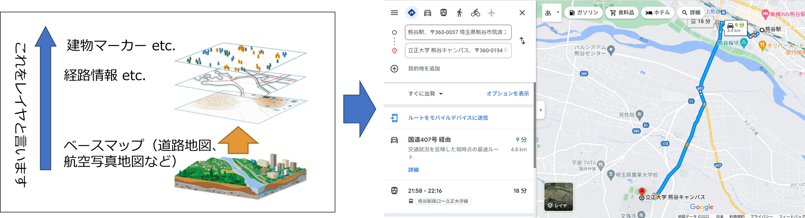
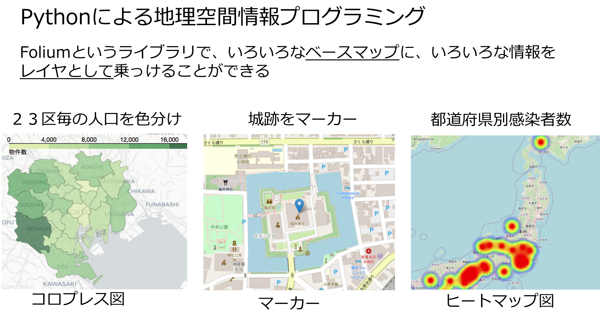
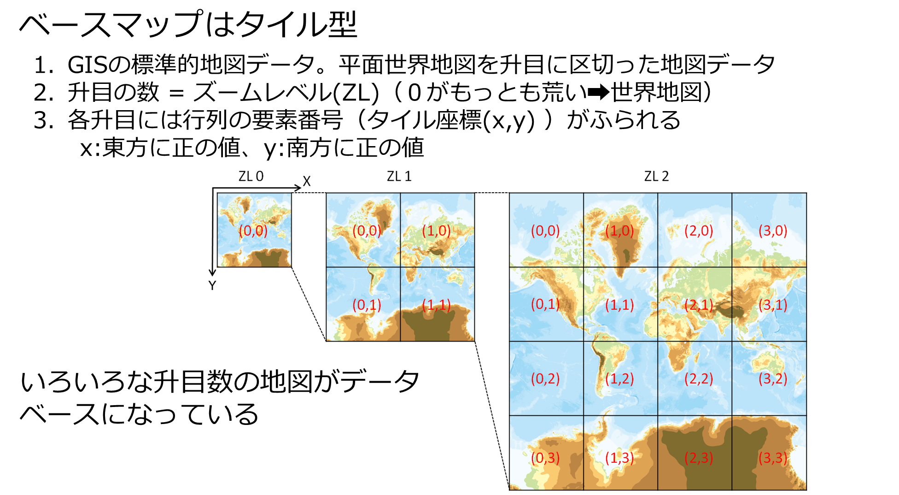
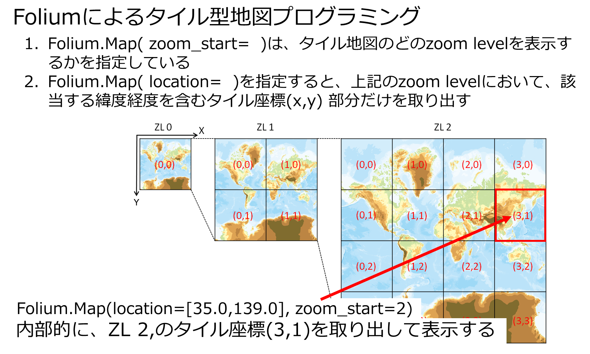

# 地理空間情報
1. 地図上に、地域特徴を意味する様々なデータを重ね合わせる
2. 地域毎の特徴を一目で理解するための可視化技術





# 1.ベース地図と種類
ベース地図は、いろいろに変えることができる。ベース地図を拡大縮小できるのは、タイル型と呼ばれる画像データ
になっているから。実際、ベース地図は、tiles=  で指定する。ベース地図を拡大縮小できるのは、タイル型と呼ばれる画像データになっているから。タイル型地図の詳しくはスライドを参照。

### （1）foliumのベース地図を表示する
base_map = folium.Map(location=[35.655616,139.338853],zoom_start=5.0)はベースマップを用意するもの。location=は表示
の中心となる緯度経度。zoom_startは表示した当初のzoom率（大きい値ほどズームイン）。 

# 演習1
- zoom_start=をいろいろ変えるとどうなるかを確認ください。
- マウスでピンチインアウトすると、地図が拡大縮小することを確認して下さい。
- 以下のリンクを踏んで、ベースマップを変えて表示してみてください（表示できないものもある）。
https://www.monotalk.xyz/blog/python-folium-%E6%8C%87%E5%AE%9A%E3%81%A7%E3%81%8D%E3%82%8B-%E5%9C%B0%E5%9B%B3%E3%81%AE-%E3%82%BF%E3%82%A4%E3%83%AB-%E3%81%AB%E3%81%A4%E3%81%84%E3%81%A6/


```python
!pip install folium
!pip install geocoder
```

    Requirement already satisfied: folium in c:\anaconda\lib\site-packages (0.17.0)
    Requirement already satisfied: branca>=0.6.0 in c:\anaconda\lib\site-packages (from folium) (0.7.2)
    Requirement already satisfied: jinja2>=2.9 in c:\anaconda\lib\site-packages (from folium) (3.1.3)
    Requirement already satisfied: numpy in c:\anaconda\lib\site-packages (from folium) (1.24.4)
    Requirement already satisfied: requests in c:\anaconda\lib\site-packages (from folium) (2.31.0)
    Requirement already satisfied: xyzservices in c:\anaconda\lib\site-packages (from folium) (2022.9.0)
    Requirement already satisfied: MarkupSafe>=2.0 in c:\anaconda\lib\site-packages (from jinja2>=2.9->folium) (2.1.3)
    Requirement already satisfied: charset-normalizer<4,>=2 in c:\anaconda\lib\site-packages (from requests->folium) (2.0.4)
    Requirement already satisfied: idna<4,>=2.5 in c:\anaconda\lib\site-packages (from requests->folium) (3.8)
    Requirement already satisfied: urllib3<3,>=1.21.1 in c:\anaconda\lib\site-packages (from requests->folium) (2.0.7)
    Requirement already satisfied: certifi>=2017.4.17 in c:\anaconda\lib\site-packages (from requests->folium) (2024.7.4)
    Requirement already satisfied: geocoder in c:\anaconda\lib\site-packages (1.38.1)
    Requirement already satisfied: click in c:\anaconda\lib\site-packages (from geocoder) (8.1.7)
    Requirement already satisfied: future in c:\anaconda\lib\site-packages (from geocoder) (0.18.3)
    Requirement already satisfied: ratelim in c:\anaconda\lib\site-packages (from geocoder) (0.1.6)
    Requirement already satisfied: requests in c:\anaconda\lib\site-packages (from geocoder) (2.31.0)
    Requirement already satisfied: six in c:\anaconda\lib\site-packages (from geocoder) (1.16.0)
    Requirement already satisfied: colorama in c:\anaconda\lib\site-packages (from click->geocoder) (0.4.6)
    Requirement already satisfied: decorator in c:\anaconda\lib\site-packages (from ratelim->geocoder) (5.1.1)
    Requirement already satisfied: charset-normalizer<4,>=2 in c:\anaconda\lib\site-packages (from requests->geocoder) (2.0.4)
    Requirement already satisfied: idna<4,>=2.5 in c:\anaconda\lib\site-packages (from requests->geocoder) (3.8)
    Requirement already satisfied: urllib3<3,>=1.21.1 in c:\anaconda\lib\site-packages (from requests->geocoder) (2.0.7)
    Requirement already satisfied: certifi>=2017.4.17 in c:\anaconda\lib\site-packages (from requests->geocoder) (2024.7.4)
    


```python
import folium
base_map = folium.Map(location=[35.655616,139.338853],tiles='OpenStreetMap',zoom_start=5.0)
base_map
```


<div style="width:100%;"><div style="position:relative;width:100%;height:0;padding-bottom:60%;"><span style="color:#565656">Make this Notebook Trusted to load map: File -> Trust Notebook</span><iframe srcdoc="&lt;!DOCTYPE html&gt;
&lt;html&gt;
&lt;head&gt;

    &lt;meta http-equiv=&quot;content-type&quot; content=&quot;text/html; charset=UTF-8&quot; /&gt;

        &lt;script&gt;
            L_NO_TOUCH = false;
            L_DISABLE_3D = false;
        &lt;/script&gt;

    &lt;style&gt;html, body {width: 100%;height: 100%;margin: 0;padding: 0;}&lt;/style&gt;
    &lt;style&gt;#map {position:absolute;top:0;bottom:0;right:0;left:0;}&lt;/style&gt;
    &lt;script src=&quot;https://cdn.jsdelivr.net/npm/leaflet@1.9.3/dist/leaflet.js&quot;&gt;&lt;/script&gt;
    &lt;script src=&quot;https://code.jquery.com/jquery-3.7.1.min.js&quot;&gt;&lt;/script&gt;
    &lt;script src=&quot;https://cdn.jsdelivr.net/npm/bootstrap@5.2.2/dist/js/bootstrap.bundle.min.js&quot;&gt;&lt;/script&gt;
    &lt;script src=&quot;https://cdnjs.cloudflare.com/ajax/libs/Leaflet.awesome-markers/2.0.2/leaflet.awesome-markers.js&quot;&gt;&lt;/script&gt;
    &lt;link rel=&quot;stylesheet&quot; href=&quot;https://cdn.jsdelivr.net/npm/leaflet@1.9.3/dist/leaflet.css&quot;/&gt;
    &lt;link rel=&quot;stylesheet&quot; href=&quot;https://cdn.jsdelivr.net/npm/bootstrap@5.2.2/dist/css/bootstrap.min.css&quot;/&gt;
    &lt;link rel=&quot;stylesheet&quot; href=&quot;https://netdna.bootstrapcdn.com/bootstrap/3.0.0/css/bootstrap-glyphicons.css&quot;/&gt;
    &lt;link rel=&quot;stylesheet&quot; href=&quot;https://cdn.jsdelivr.net/npm/@fortawesome/fontawesome-free@6.2.0/css/all.min.css&quot;/&gt;
    &lt;link rel=&quot;stylesheet&quot; href=&quot;https://cdnjs.cloudflare.com/ajax/libs/Leaflet.awesome-markers/2.0.2/leaflet.awesome-markers.css&quot;/&gt;
    &lt;link rel=&quot;stylesheet&quot; href=&quot;https://cdn.jsdelivr.net/gh/python-visualization/folium/folium/templates/leaflet.awesome.rotate.min.css&quot;/&gt;

            &lt;meta name=&quot;viewport&quot; content=&quot;width=device-width,
                initial-scale=1.0, maximum-scale=1.0, user-scalable=no&quot; /&gt;
            &lt;style&gt;
                #map_8c2b14ec8bf8ac834f83c27803011a6f {
                    position: relative;
                    width: 100.0%;
                    height: 100.0%;
                    left: 0.0%;
                    top: 0.0%;
                }
                .leaflet-container { font-size: 1rem; }
            &lt;/style&gt;

&lt;/head&gt;
&lt;body&gt;


            &lt;div class=&quot;folium-map&quot; id=&quot;map_8c2b14ec8bf8ac834f83c27803011a6f&quot; &gt;&lt;/div&gt;

&lt;/body&gt;
&lt;script&gt;


            var map_8c2b14ec8bf8ac834f83c27803011a6f = L.map(
                &quot;map_8c2b14ec8bf8ac834f83c27803011a6f&quot;,
                {
                    center: [35.655616, 139.338853],
                    crs: L.CRS.EPSG3857,
                    zoom: 5.0,
                    zoomControl: true,
                    preferCanvas: false,
                }
            );


            var tile_layer_01d760b57aa662875392099b418100fe = L.tileLayer(
                &quot;https://tile.openstreetmap.org/{z}/{x}/{y}.png&quot;,
                {&quot;attribution&quot;: &quot;\u0026copy; \u003ca href=\&quot;https://www.openstreetmap.org/copyright\&quot;\u003eOpenStreetMap\u003c/a\u003e contributors&quot;, &quot;detectRetina&quot;: false, &quot;maxNativeZoom&quot;: 19, &quot;maxZoom&quot;: 19, &quot;minZoom&quot;: 0, &quot;noWrap&quot;: false, &quot;opacity&quot;: 1, &quot;subdomains&quot;: &quot;abc&quot;, &quot;tms&quot;: false}
            );


            tile_layer_01d760b57aa662875392099b418100fe.addTo(map_8c2b14ec8bf8ac834f83c27803011a6f);

&lt;/script&gt;
&lt;/html&gt;" style="position:absolute;width:100%;height:100%;left:0;top:0;border:none !important;" allowfullscreen webkitallowfullscreen mozallowfullscreen></iframe></div></div>






### (2) 国土地理院のタイル型地図をベースマップにする  

1. 国土地理院ベースマップ。以下のリンクのベースマップにzoom level別の表示があるので、これに従って、以下のコーディングのzoom_startを変えてみると表示が様変わりするので面白い（例えば、道路地図が住宅地図に切り替わったりする）  
https://maps.gsi.go.jp/development/ichiran.html  

2. 日本の空間情報データベースとしては、ダントツ豊富　（土地条件、火山、湖沼、沿岸、写真、。。。かつ  高解像度（田んぼの畦まで見え
3. geocoder : 地名を入力すると自動的に緯度経度を算出する

# 演習 2.  


国土地理院のページのタイル地図リンクを、以下のコード中のkokudo_map=以下に張り付けていろいろなベースマップを試してください。（国土地理院データの場合は、tiles= に表示したい地図タイルのURLを指定する。ただし動かいない地図もある）  

国土地理院  
https://maps.gsi.go.jp/development/ichiran.html  

写真地図 URL：https://cyberjapandata.gsi.go.jp/xyz/seamlessphoto/{z}/{x}/{y}.jpg093


```python
import folium

loc=[35.6799438164396, 139.758466437117]#皇居の位置する緯度経度
kokudo_map ='https://cyberjapandata.gsi.go.jp/xyz/std/{z}/{x}/{y}.png'
#kokudo_map ='https://cyberjapandata.gsi.go.jp/xyz/seamlessphoto/{z}/{x}/{y}.jpg'
base_map = folium.Map(location=loc,tiles=kokudo_map,attr='標準地図',zoom_start=9.0)
base_map
```


<div style="width:100%;"><div style="position:relative;width:100%;height:0;padding-bottom:60%;"><span style="color:#565656">Make this Notebook Trusted to load map: File -> Trust Notebook</span><iframe srcdoc="&lt;!DOCTYPE html&gt;
&lt;html&gt;
&lt;head&gt;

    &lt;meta http-equiv=&quot;content-type&quot; content=&quot;text/html; charset=UTF-8&quot; /&gt;

        &lt;script&gt;
            L_NO_TOUCH = false;
            L_DISABLE_3D = false;
        &lt;/script&gt;

    &lt;style&gt;html, body {width: 100%;height: 100%;margin: 0;padding: 0;}&lt;/style&gt;
    &lt;style&gt;#map {position:absolute;top:0;bottom:0;right:0;left:0;}&lt;/style&gt;
    &lt;script src=&quot;https://cdn.jsdelivr.net/npm/leaflet@1.9.3/dist/leaflet.js&quot;&gt;&lt;/script&gt;
    &lt;script src=&quot;https://code.jquery.com/jquery-3.7.1.min.js&quot;&gt;&lt;/script&gt;
    &lt;script src=&quot;https://cdn.jsdelivr.net/npm/bootstrap@5.2.2/dist/js/bootstrap.bundle.min.js&quot;&gt;&lt;/script&gt;
    &lt;script src=&quot;https://cdnjs.cloudflare.com/ajax/libs/Leaflet.awesome-markers/2.0.2/leaflet.awesome-markers.js&quot;&gt;&lt;/script&gt;
    &lt;link rel=&quot;stylesheet&quot; href=&quot;https://cdn.jsdelivr.net/npm/leaflet@1.9.3/dist/leaflet.css&quot;/&gt;
    &lt;link rel=&quot;stylesheet&quot; href=&quot;https://cdn.jsdelivr.net/npm/bootstrap@5.2.2/dist/css/bootstrap.min.css&quot;/&gt;
    &lt;link rel=&quot;stylesheet&quot; href=&quot;https://netdna.bootstrapcdn.com/bootstrap/3.0.0/css/bootstrap-glyphicons.css&quot;/&gt;
    &lt;link rel=&quot;stylesheet&quot; href=&quot;https://cdn.jsdelivr.net/npm/@fortawesome/fontawesome-free@6.2.0/css/all.min.css&quot;/&gt;
    &lt;link rel=&quot;stylesheet&quot; href=&quot;https://cdnjs.cloudflare.com/ajax/libs/Leaflet.awesome-markers/2.0.2/leaflet.awesome-markers.css&quot;/&gt;
    &lt;link rel=&quot;stylesheet&quot; href=&quot;https://cdn.jsdelivr.net/gh/python-visualization/folium/folium/templates/leaflet.awesome.rotate.min.css&quot;/&gt;

            &lt;meta name=&quot;viewport&quot; content=&quot;width=device-width,
                initial-scale=1.0, maximum-scale=1.0, user-scalable=no&quot; /&gt;
            &lt;style&gt;
                #map_73835d3cec428dcee0f483d278c9ba36 {
                    position: relative;
                    width: 100.0%;
                    height: 100.0%;
                    left: 0.0%;
                    top: 0.0%;
                }
                .leaflet-container { font-size: 1rem; }
            &lt;/style&gt;

&lt;/head&gt;
&lt;body&gt;


            &lt;div class=&quot;folium-map&quot; id=&quot;map_73835d3cec428dcee0f483d278c9ba36&quot; &gt;&lt;/div&gt;

&lt;/body&gt;
&lt;script&gt;


            var map_73835d3cec428dcee0f483d278c9ba36 = L.map(
                &quot;map_73835d3cec428dcee0f483d278c9ba36&quot;,
                {
                    center: [35.6799438164396, 139.758466437117],
                    crs: L.CRS.EPSG3857,
                    zoom: 9.0,
                    zoomControl: true,
                    preferCanvas: false,
                }
            );


            var tile_layer_2f5b3c8b530a35c99072e584af22e0b6 = L.tileLayer(
                &quot;https://cyberjapandata.gsi.go.jp/xyz/std/{z}/{x}/{y}.png&quot;,
                {&quot;attribution&quot;: &quot;\u6a19\u6e96\u5730\u56f3&quot;, &quot;detectRetina&quot;: false, &quot;maxZoom&quot;: 18, &quot;minZoom&quot;: 0, &quot;noWrap&quot;: false, &quot;opacity&quot;: 1, &quot;subdomains&quot;: &quot;abc&quot;, &quot;tms&quot;: false}
            );


            tile_layer_2f5b3c8b530a35c99072e584af22e0b6.addTo(map_73835d3cec428dcee0f483d278c9ba36);

&lt;/script&gt;
&lt;/html&gt;" style="position:absolute;width:100%;height:100%;left:0;top:0;border:none !important;" allowfullscreen webkitallowfullscreen mozallowfullscreen></iframe></div></div>


```python

```
